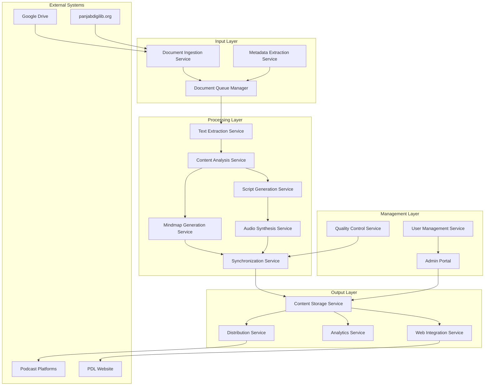

# Design Document: Punjabi AI Podcasts

## Overview

The Punjabi AI Podcasts system is designed to transform the Panjab Digital Library's (PDL) collection of documents into engaging, accessible audio podcasts with synchronized visual mindmaps. The system leverages Google's AI technologies, particularly NotebookLM's Audio Overview feature, to automatically generate conversational audio content from PDFs stored either directly in the system, on Google Drive, or on panjabdigilib.org.

This design document outlines the architecture, components, data models, and implementation strategies for creating a scalable, accessible, and high-quality audio content generation system that preserves and promotes Punjabi cultural heritage.

## Architecture

The system follows a microservices architecture with event-driven processing to ensure scalability, resilience, and maintainability. The architecture consists of the following layers:

### 1. Input Layer
- **Document Ingestion Service**: Handles document uploads and retrieval from multiple sources (direct upload, Google Drive, panjabdigilib.org)
- **Document Queue Manager**: Manages the processing queue for documents
- **Metadata Extraction Service**: Extracts and validates document metadata

### 2. Processing Layer
- **Text Extraction Service**: Converts PDFs to machine-readable text
- **Content Analysis Service**: Analyzes text to identify key themes, topics, and structure
- **Script Generation Service**: Creates conversational scripts between AI hosts
- **Mindmap Generation Service**: Creates visual representations of content relationships
- **Audio Synthesis Service**: Converts scripts to natural-sounding audio
- **Synchronization Service**: Aligns audio with visual mindmaps

### 3. Output Layer
- **Content Storage Service**: Manages storage of generated assets
- **Distribution Service**: Handles publishing to various platforms
- **Analytics Service**: Tracks engagement and performance metrics
- **Web Integration Service**: Manages embedding on PDL website

### 4. Management Layer
- **Admin Portal**: Interface for content managers to review and approve content
- **Quality Control Service**: Automated checks for content quality
- **User Management Service**: Handles authentication and authorization

### System Architecture Diagram



## Components and Interfaces

### 1. Document Ingestion Service

**Responsibilities:**
- Accept direct document uploads
- Connect to Google Drive API to retrieve documents
- Scrape or API integration with panjabdigilib.org
- Validate document formats and quality
- Route documents to the queue manager

**Interfaces:**
- REST API for direct uploads
- Google Drive API client
- Web scraping or API client for panjabdigilib.org
- Message queue producer for document processing queue

### 2. Text Extraction Service

**Responsibilities:**
- Convert PDF documents to plain text
- Handle OCR for scanned documents
- Preserve document structure
- Support Punjabi language text extraction
- Clean and normalize extracted text

**Interfaces:**
- Google Document AI API client
- OCR processing pipeline
- Text normalization utilities
- Message queue consumer/producer

### 3. Content Analysis Service

**Responsibilities:**
- Identify key themes, topics, and concepts
- Extract named entities (people, places, events)
- Determine document structure and hierarchy
- Generate content metadata for script creation

**Interfaces:**
- Google Natural Language API client
- Gemini API client for content analysis
- Custom NLP pipeline for Punjabi language
- Knowledge graph builder

### 4. Script Generation Service

**Responsibilities:**
- Create conversational scripts between two AI hosts
- Ensure cultural sensitivity and accuracy
- Structure content for engaging audio presentation
- Support both English and Punjabi languages

**Interfaces:**
- Gemini API client for script generation
- Template engine for script formatting
- Cultural context validation system
- Message queue consumer/producer

### 5. Mindmap Generation Service

**Responsibilities:**
- Create visual mindmaps representing content relationships
- Generate visually accessible diagrams
- Support customization of visual style
- Ensure synchronization points with audio

**Interfaces:**
- Graph visualization library
- Image generation API
- Customization parameter system
- Synchronization marker system

### 6. Audio Synthesis Service

**Responsibilities:**
- Convert scripts to natural-sounding audio
- Support multiple voices for different hosts
- Handle Punjabi language pronunciation
- Apply appropriate pacing, emphasis, and intonation

**Interfaces:**
- Google Cloud Text-to-Speech API client
- Voice customization parameters
- Audio processing utilities
- Message queue consumer/producer

### 7. Synchronization Service

**Responsibilities:**
- Align audio narration with visual mindmaps
- Generate video presentations with synchronized elements
- Create navigation markers for content sections
- Ensure accessibility features are included

**Interfaces:**
- Video generation library
- Audio/visual synchronization engine
- Accessibility feature generator
- Message queue consumer/producer

### 8. Distribution Service

**Responsibilities:**
- Publish content to podcast platforms (Spotify, Apple Podcasts)
- Generate RSS feeds for podcast distribution
- Upload videos to YouTube and other platforms
- Create embeddable players for PDL website
- Generate QR codes for physical exhibitions

**Interfaces:**
- Podcast platform APIs
- RSS feed generator
- YouTube API client
- Embeddable player generator
- QR code generator

### 9. Admin Portal

**Responsibilities:**
- Provide interface for content review and approval
- Allow customization of voice and visual styles
- Display processing status and analytics
- Manage user permissions and access

**Interfaces:**
- Web application frontend
- Content review workflow
- Customization controls
- Analytics dashboard

## Data Models

### 1. Document Model

```json
{
  "id": "string",
  "title": "string",
  "author": "string",
  "description": "string",
  "language": "string",
  "source": {
    "type": "enum(UPLOAD, GOOGLE_DRIVE, PANJABDIGILIB)",
    "location": "string",
    "metadata": {}
  },
  "uploadDate": "datetime",
  "status": "enum(QUEUED, PROCESSING, COMPLETED, ERROR)",
  "processingMetadata": {
    "extractionStatus": "enum(PENDING, IN_PROGRESS, COMPLETED, ERROR)",
    "analysisStatus": "enum(PENDING, IN_PROGRESS, COMPLETED, ERROR)",
    "scriptStatus": "enum(PENDING, IN_PROGRESS, COMPLETED, ERROR)",
    "mindmapStatus": "enum(PENDING, IN_PROGRESS, COMPLETED, ERROR)",
    "audioStatus": "enum(PENDING, IN_PROGRESS, COMPLETED, ERROR)",
    "syncStatus": "enum(PENDING, IN_PROGRESS, COMPLETED, ERROR)",
    "distributionStatus": "enum(PENDING, IN_PROGRESS, COMPLETED, ERROR)"
  },
  "tags": ["string"],
  "collections": ["string"]
}
```

### 2. Content Model

```json
{
  "id": "string",
  "documentId": "string",
  "extractedText": "string",
  "analysis": {
    "themes": ["string"],
    "entities": [
      {
        "name": "string",
        "type": "enum(PERSON, PLACE, EVENT, CONCEPT)",
        "importance": "number"
      }
    ],
    "structure": {
      "sections": [
        {
          "title": "string",
          "content": "string",
          "level": "number"
        }
      ]
    },
    "summary": "string"
  },
  "script": {
    "language": "string",
    "conversations": [
      {
        "speaker": "enum(HOST1, HOST2)",
        "text": "string",
        "timing": "number"
      }
    ]
  },
  "mindmap": {
    "nodes": [
      {
        "id": "string",
        "label": "string",
        "type": "string",
        "connections": ["string"]
      }
    ],
    "style": {
      "colorScheme": "string",
      "layout": "string",
      "fontFamily": "string"
    }
  }
}
```

### 3. Media Model

```json
{
  "id": "string",
  "contentId": "string",
  "audio": {
    "url": "string",
    "format": "string",
    "duration": "number",
    "language": "string",
    "transcript": "string"
  },
  "video": {
    "url": "string",
    "format": "string",
    "duration": "number",
    "resolution": "string"
  },
  "mindmapImage": {
    "url": "string",
    "format": "string",
    "width": "number",
    "height": "number"
  },
  "synchronizationMarkers": [
    {
      "time": "number",
      "nodeId": "string",
      "description": "string"
    }
  ]
}
```

### 4. Distribution Model

```json
{
  "id": "string",
  "mediaId": "string",
  "platforms": [
    {
      "type": "enum(SPOTIFY, APPLE_PODCASTS, YOUTUBE, PDL_WEBSITE)",
      "url": "string",
      "publishDate": "datetime",
      "status": "enum(DRAFT, PUBLISHED, ERROR)"
    }
  ],
  "rssFeeds": [
    {
      "name": "string",
      "url": "string"
    }
  ],
  "embedCodes": {
    "iframe": "string",
    "shortcode": "string"
  },
  "qrCodes": [
    {
      "name": "string",
      "url": "string",
      "imageUrl": "string"
    }
  ],
  "analytics": {
    "views": "number",
    "listens": "number",
    "shares": "number",
    "averageEngagementTime": "number",
    "platformBreakdown": {}
  }
}
```

### 5. User Model

```json
{
  "id": "string",
  "name": "string",
  "email": "string",
  "role": "enum(ADMIN, CURATOR, VIEWER)",
  "permissions": ["string"],
  "preferences": {
    "defaultLanguage": "string",
    "notificationSettings": {}
  }
}
```

## Error Handling

### 1. Document Processing Errors

- **Invalid Document Format**: Detect and report unsupported formats
- **OCR Failures**: Identify low-confidence text extraction and flag for manual review
- **Language Detection Issues**: Handle documents with mixed languages or unsupported scripts
- **Processing Timeout**: Implement circuit breakers for long-running processes

### 2. Content Generation Errors

- **Script Generation Failures**: Fallback to template-based generation for problematic content
- **Mindmap Complexity Limits**: Handle overly complex documents with simplified visualizations
- **Audio Synthesis Issues**: Detect and report pronunciation problems or voice inconsistencies
- **Synchronization Errors**: Implement automatic adjustment for timing mismatches

### 3. Distribution Errors

- **Platform API Failures**: Implement retry mechanisms with exponential backoff
- **Content Rejection**: Handle platform-specific content guidelines and restrictions
- **Quota Limitations**: Manage API rate limits and quotas across services

### 4. Error Logging and Monitoring

- **Centralized Error Logging**: Aggregate errors across all services
- **Error Classification**: Categorize errors by severity and type
- **Alerting System**: Notify administrators of critical failures
- **Error Analytics**: Track error patterns to identify systemic issues

### 5. User-Facing Error Handling

- **Friendly Error Messages**: Translate technical errors to user-friendly messages
- **Recovery Options**: Provide clear paths to resolve issues
- **Progress Preservation**: Ensure work is not lost during failures
- **Partial Success Handling**: Allow proceeding with partially successful operations

## Testing Strategy

### 1. Unit Testing

- Test individual components and services in isolation
- Mock external dependencies (Google APIs, storage services)
- Verify correct handling of various input types and edge cases
- Ensure error handling works as expected

### 2. Integration Testing

- Test interactions between services
- Verify correct message passing and event handling
- Test database operations and data consistency
- Validate API contracts between services

### 3. End-to-End Testing

- Test complete document processing workflows
- Verify content generation quality and accuracy
- Test distribution to various platforms
- Validate user interfaces and admin portal functionality

### 4. Performance Testing

- Measure processing time for various document types and sizes
- Test system under load with concurrent document processing
- Verify scalability of the architecture
- Identify and address bottlenecks

### 5. Accessibility Testing

- Verify screen reader compatibility
- Test keyboard navigation
- Ensure color contrast and visual accessibility
- Validate multilingual support

### 6. Security Testing

- Audit authentication and authorization mechanisms
- Test for common vulnerabilities (injection, XSS, CSRF)
- Verify secure handling of user data
- Test API security and rate limiting

## Implementation Considerations

### 1. Technology Stack

- **Backend Services**: Node.js/TypeScript or Python for microservices
- **API Gateway**: Express.js or FastAPI
- **Message Queue**: RabbitMQ or Google Cloud Pub/Sub
- **Database**: MongoDB for document storage, PostgreSQL for relational data
- **Storage**: Google Cloud Storage for media files
- **AI Services**: Google Cloud AI APIs (Document AI, Natural Language, Text-to-Speech, Gemini)
- **Frontend**: React.js for admin portal
- **Containerization**: Docker with Kubernetes orchestration
- **CI/CD**: GitHub Actions or GitLab CI

### 2. Scalability Considerations

- Implement horizontal scaling for processing services
- Use auto-scaling based on queue depth
- Implement caching for frequently accessed content
- Optimize storage with tiered access patterns
- Use CDN for media delivery

### 3. Security Considerations

- Implement OAuth 2.0 for authentication
- Use role-based access control
- Encrypt sensitive data at rest and in transit
- Implement API rate limiting
- Regular security audits and vulnerability scanning

### 4. Monitoring and Observability

- Implement distributed tracing
- Set up comprehensive logging
- Create dashboards for system health
- Configure alerts for critical metrics
- Implement user activity auditing

### 5. Deployment Strategy

- Use blue-green deployment for zero downtime
- Implement feature flags for gradual rollout
- Set up staging environment for pre-production testing
- Automate deployment pipelines
- Implement database migration strategies

## Future Enhancements

1. **Advanced Personalization**: Allow users to customize content focus and depth
2. **Interactive Mindmaps**: Enable clickable elements in mindmaps for deeper exploration
3. **User Feedback Loop**: Incorporate user feedback to improve content generation
4. **Additional Languages**: Expand beyond English and Punjabi to other regional languages
5. **AR/VR Integration**: Create immersive experiences for exhibition content
6. **Voice Customization**: Allow selection of different voice profiles and speaking styles
7. **Content Recommendations**: Implement AI-driven recommendations for related content
8. **Live Streaming**: Support live audio discussions based on document themes